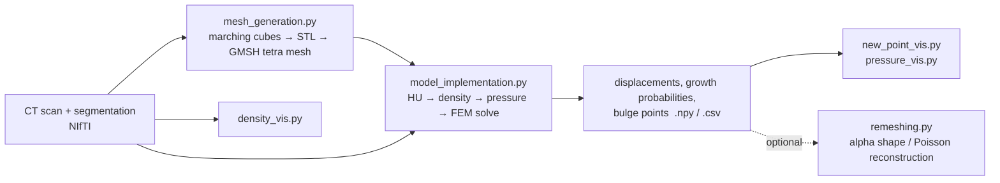

# Mesothelioma Growth Model

**CT-informed biomechanical simulation of mesothelioma tumour growth with the finite element method.**

> **This is my MSc thesis model (2025), kept as it was.** It computes a single deformation step. I later revisited the unfinished part, iterative geometry evolution, in **[mesothelioma-iterative-growth](https://github.com/sachagijsbers/mesothelioma-iterative-growth)**: prescribed growth, CT-derived tissue stiffness and a controlled experiment. The thesis version is tagged [`msc-thesis-2025`](https://github.com/sachagijsbers/mesothelioma-growth-model/tree/msc-thesis-2025).

Malignant pleural mesothelioma grows as an irregular rind along the pleura, and where it expands next is shaped by the tissue around it. This project builds a pipeline from a thorax CT scan and a tumour segmentation to a patient-specific finite element model. Tissue density taken from the CT drives internal forces in a linear elastic tumour, and the resulting displacement field is used to flag regions where the tumour is most likely to bulge outward.

`Python` · `DolfinX / FEniCSx` · `PETSc` · `GMSH` · `nibabel` · `scikit-image` · `Open3D` · `trimesh` · `PyVista`

---

## Pipeline



## Model

**1. Geometry.** The segmentation mask is turned into a surface with marching cubes (using the voxel spacing), simplified and repaired with `trimesh`, and meshed into linear tetrahedra with GMSH (Netgen optimisation).

**2. Tissue density.** CT intensities are converted to Hounsfield units using the NIfTI slope and intercept, then mapped to an approximate mass density

$$\rho = \max\left(\frac{\mathrm{HU} + 1000}{1000},\ 0\right)\ \ \mathrm{g/cm^3}$$

and averaged over a small voxel neighbourhood around every mesh vertex.

**3. Density-driven load.** Denser tissue pushes harder. At each vertex a pressure is computed and applied as a body force, directed towards the nearest boundary for interior vertices and inward for boundary vertices:

$$p = k \cdot \max(\rho - \rho_0,\ 0), \qquad \mathbf{f} = p\,\hat{\mathbf{d}}$$

with $k = 5000$ and $\rho_0 = 1.0$.

**4. Linear elasticity.** The displacement $\mathbf{u}$ solves

$$-\nabla \cdot \boldsymbol{\sigma}(\mathbf{u}) = \mathbf{f}, \qquad \boldsymbol{\sigma} = \lambda\,\mathrm{tr}(\boldsymbol{\varepsilon})\,\mathbf{I} + 2\mu\,\boldsymbol{\varepsilon}, \qquad \boldsymbol{\varepsilon} = \tfrac{1}{2}(\nabla\mathbf{u} + \nabla\mathbf{u}^\top)$$

with $E = 10^5$ Pa and $\nu = 0.3$. The tumour is anchored ($\mathbf{u} = 0$) at bone-like vertices ($\rho \geq 2.0$ g/cm³) and at the density-weighted centroid. The problem is discretised with P1 vector Lagrange elements in DolfinX and solved with conjugate gradients preconditioned by hypre BoomerAMG.

**5. Growth regions.** Displacement magnitudes are min-max normalised to a per-vertex *growth probability*. Vertices displaced more than mean + 5 standard deviations seed a region-growing step that marks candidate bulges.

## Repository structure

| File | Purpose |
|---|---|
| `mesh_generation.py` | Segmentation → surface → repaired STL → tetrahedral mesh (`tumor.msh`, `.vtk`) |
| `model_implementation.py` | Main model: density sampling, load assembly, FEM solve, growth probabilities, bulge detection |
| `remeshing.py` | Point cloud → watertight mesh (Open3D alpha shapes, Poisson reconstruction, MeshFix) and `.geo` export for GMSH |
| `density_vis.py` | CT slices with tumour density overlay, HU histograms for the whole scan vs. the tumour |
| `pressure_vis.py` | Pressure distribution and sensitivity of the mean pressure to the scaling constant $k$ |
| `new_point_vis.py` | Growth probability histogram, pressure vs. probability, 3D overlay of predicted bulge points |

## Getting started

DolfinX is easiest to install via conda or Docker; the other dependencies are in `requirements.txt`.

```bash
conda create -n meso -c conda-forge python=3.11 fenics-dolfinx mpich pyvista
conda activate meso
pip install -r requirements.txt
```

Place the input files in the working directory and run the steps in order:

```text
CT_scan.nii.gz        thorax CT scan
Segmentation.nii.gz   tumour mask in the same space as the CT
```

```bash
python mesh_generation.py        # -> tumor.msh
python model_implementation.py   # -> pressure.npy, displacement_vectors.npy, probabilities.npy, bulge_points.npy
python new_point_vis.py          # figures
python pressure_vis.py
python density_vis.py
```

### Data

No imaging data is included. The CT scans come from the public *COVID-19 CT Lung and Infection Segmentation Dataset* (Ma et al., 2020): https://zenodo.org/records/3757476 ([doi:10.5281/zenodo.3757476](https://doi.org/10.5281/zenodo.3757476)), licence CC BY-NC-SA. Download them from the source; the pipeline expects NIfTI files.

## Limitations and next steps

This is a research prototype, not a validated clinical tool.

- **Mechanics.** Small-strain linear elasticity with homogeneous material parameters; real tumour and pleural tissue is heterogeneous, nonlinear and actively growing.
- **Density → pressure.** The HU-to-density and density-to-pressure mappings are heuristic, and results depend on the scaling constant $k$ (see `pressure_vis.py`).
- **"Probability".** The growth probability is a normalised displacement magnitude, not a calibrated probability.
- **Validation.** Predictions are not compared against follow-up scans in this repository.
- **Coordinates.** Vertex positions (in mm) and CT voxel indices are matched without applying the full image affine; this should be unified before quantitative use.
- **Iterative growth.** Multi-step growth requires remeshing the bulged geometry after each step. This is not wired into the loop yet, so `n_growth_steps = 1`.

Possible extensions: calibrate against longitudinal scans, hyperelastic or growth-coupled (morphoelastic) material models, and sensitivity or uncertainty analysis over $E$, $\nu$ and $k$.
